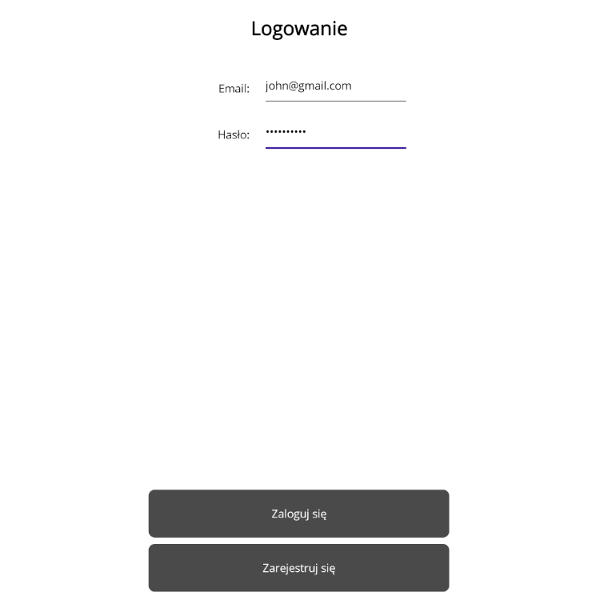
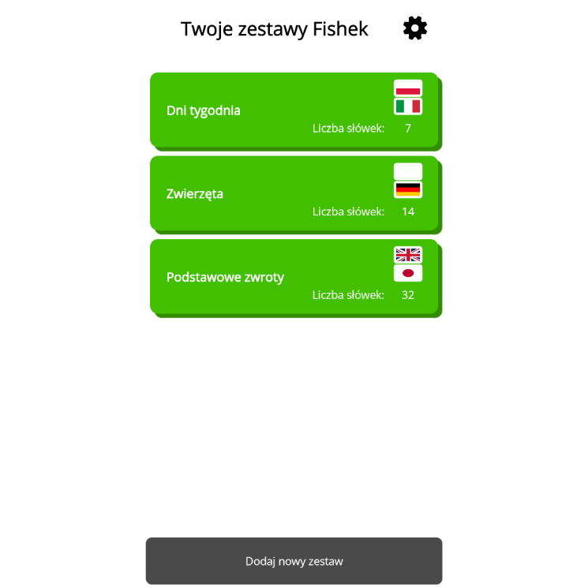
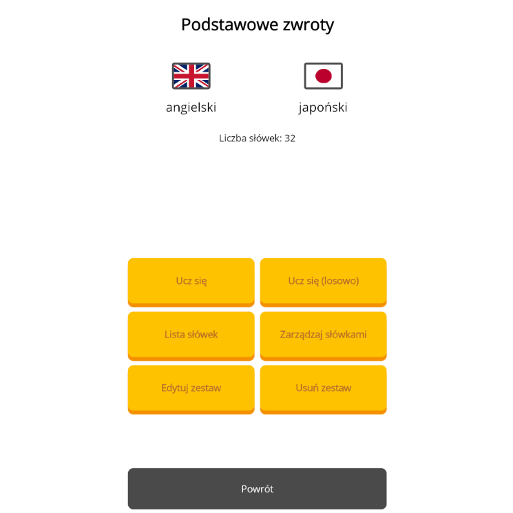
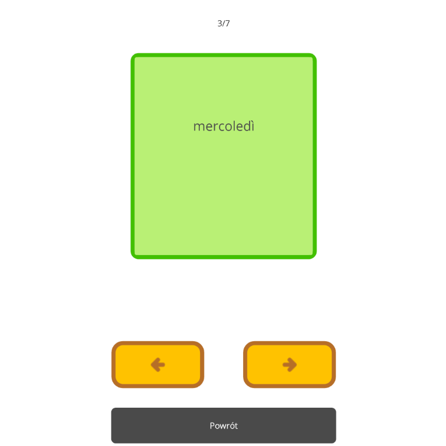

This repository is a frontent part of a project created in <b>.NET MAUI</b> for <b>Android</b> and <b>Windows</b>.
 
<u>Repository with backend: https://github.com/jakubjachxwicz/fishki_backend</u>
 
Fishki is an app designed to learn foreign languages' vocabulary using flashcards.
Each user can create their own account that stores flashcards sets.
Chose a name and two languages for your set and input pairs of translated words. Then you can view them in a list or in a form of flashcards.
Each side of a card contains a word in different language. Switch it by simply tapping. You can revise words in their fixed or random order.

Technologies used in project:
 <i>.NET MAUI, Rest API</i>

 

Repozytorium jest częścią frontendową projektu utworzoną w <b>.NET MAUI</b> dla systemu <b>Android</b> oraz <b>Windows</b>.
 
<u>Repozytorium z backendem: https://github.com/jakubjachxwicz/fishki_backend</u>
 
Fishki to aplikacja stworzona do nauki słówek języków obcych przy użyciu fiszek.
Każdy użytkownik może utworzyć własne konto ze swoimi zestawami fiszek.
Wybierz nazwę oraz 2 języki dla twojego zestawu i wprowadź pary przetłumaczonych słówek. Słówka można przeglądać w formie listy lub fiszek.
Obróć kartę ze słówkami poprzez kliknięcie w nią. Słówek można uczyć się w ich ustalonej lub losowej kolejności.

Technologie wykorzystane w projekcie:
 <i>.NET MAUI, Rest API</i>

 

 

 

 

